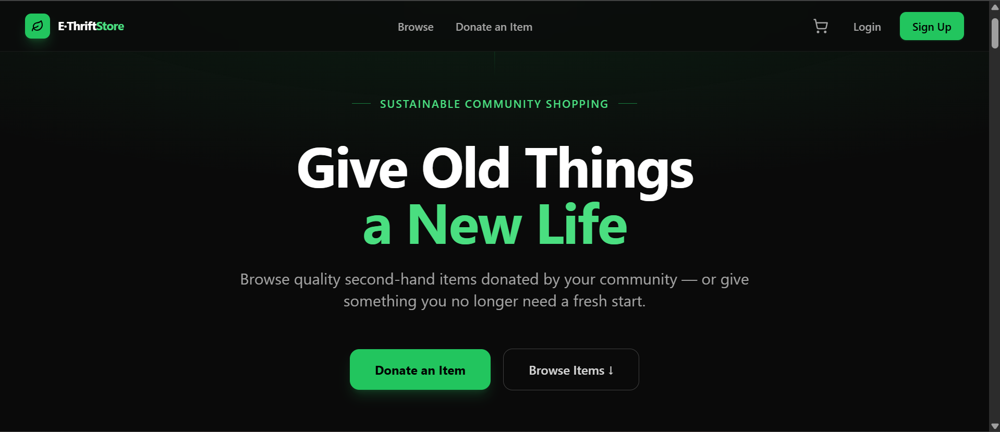
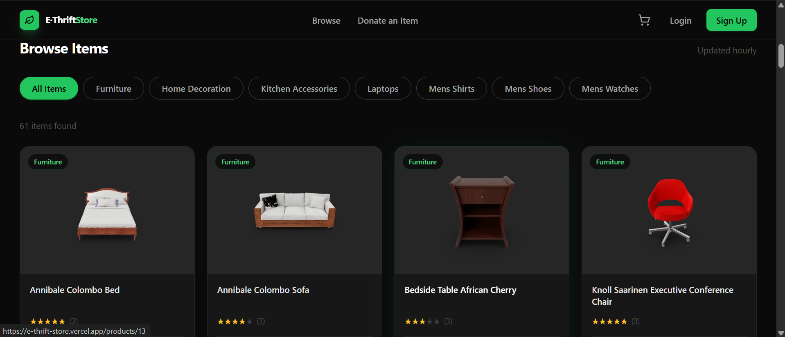
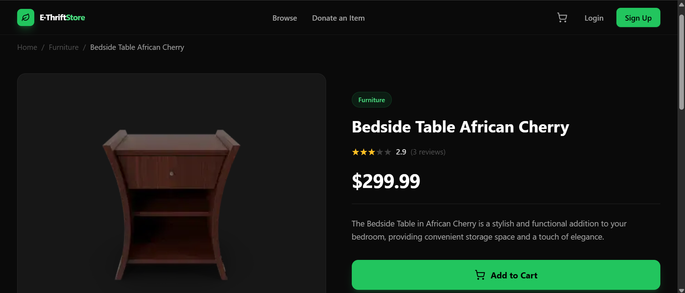
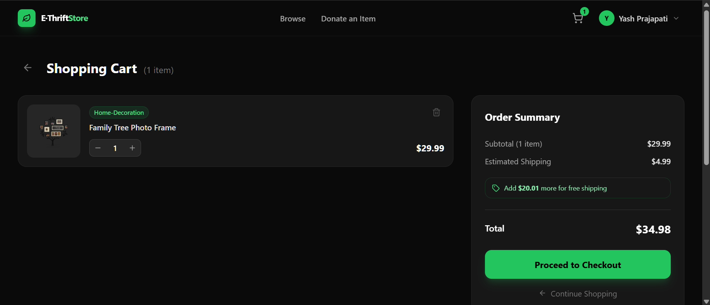
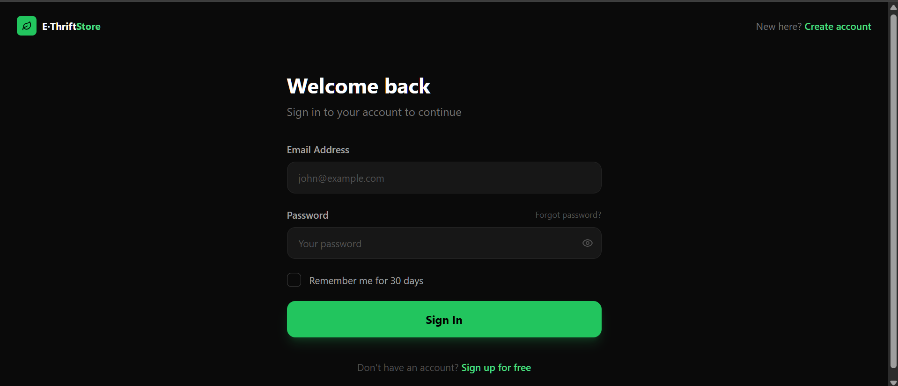
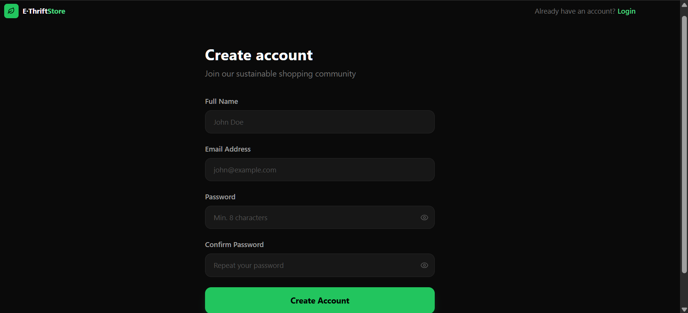
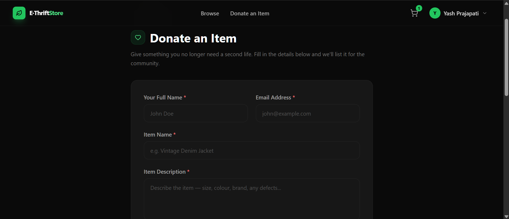
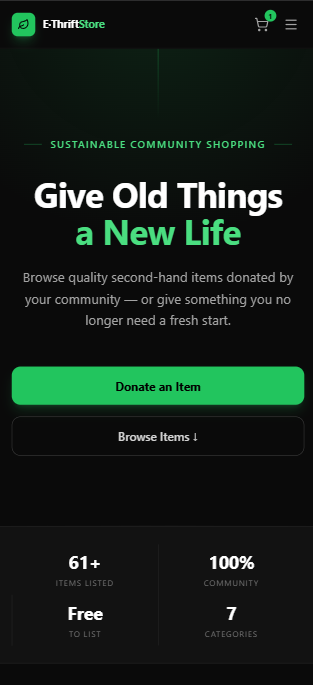

# E-Thrift Store

> Give old things a new life — a full-stack community thrift marketplace built as a portfolio project.

[](https://nextjs.org/)
[](https://www.typescriptlang.org/)
[](https://tailwindcss.com/)
[](https://www.prisma.io/)
[](https://neon.tech/)
[](https://next-auth.js.org/)

**Live Demo:** https://e-thrift-store.vercel.app

---

## Overview

E-Thrift Store is a dark-themed, full-stack e-commerce application where users can browse second-hand items, add them to a persistent cart, and donate items they no longer need. Built end-to-end across six development phases as a hands-on portfolio project.

---

## Features

- **Browse & Filter** — Product grid with category filter pills, star ratings, and hover animations
- **Product Detail Pages** — Full product view with related items, description, and "Add to Cart"
- **Authentication** — Email/password sign-up and login via NextAuth.js with JWT sessions
- **Per-User Persistent Cart** — Cart saved to PostgreSQL; survives logouts and page refreshes
- **Donate an Item** — Protected form to submit donations, saved to the database
- **User Profile** — View account details after signing in
- **Skeleton Loading** — Shimmer skeletons while product data streams in (Suspense + streaming RSC)
- **Custom Error & 404 Pages** — Graceful error states with on-brand dark theme
- **SEO Metadata** — Per-page titles and descriptions, dynamic product page metadata, favicon
- **Mobile Responsive** — Fully responsive across all screen sizes

---

## Tech Stack

| Layer | Technology |
|---|---|
| Framework | Next.js 14 (App Router, Server Components, Streaming) |
| Language | TypeScript |
| Styling | Tailwind CSS |
| Database | PostgreSQL via [Neon.tech](https://neon.tech) (serverless) |
| ORM | Prisma 5 |
| Auth | NextAuth.js v4 (Credentials provider, JWT strategy) |
| Email | [Resend](https://resend.com) (password reset + donation confirmation) |
| Icons | Lucide React |
| Product data | [DummyJSON](https://dummyjson.com) |
| Deployment | Vercel |

---

## Screenshots










---

## Running Locally

### Prerequisites
- Node.js 18+
- A PostgreSQL database (free tier on [Neon.tech](https://neon.tech) works)
- A [Resend](https://resend.com) API key (free tier) for email features

### Steps

```bash
# 1. Clone the repo
git clone https://github.com/YashPrajapati3000/e-thrift-store.git
cd e-thrift-store

# 2. Install dependencies
npm install

# 3. Set up environment variables
cp .env.example .env
# Fill in DATABASE_URL, NEXTAUTH_URL, NEXTAUTH_SECRET, RESEND_API_KEY

# 4. Push the schema to your database
npx prisma db push

# 5. Start the development server
npm run dev
```

Open [http://localhost:3000](http://localhost:3000).

### Environment Variables

```env
DATABASE_URL="postgresql://..."        # Neon (or any PostgreSQL) connection string
NEXTAUTH_URL="http://localhost:3000"   # Base URL of the app
NEXTAUTH_SECRET="..."                  # Random secret (openssl rand -base64 32)
RESEND_API_KEY="re_..."                # Get a free API key from resend.com
```

> **Note on Resend:** Without a verified custom domain, Resend can only deliver emails to your own registered Resend account email. To enable password reset and donation confirmation emails for all users, verify your domain on [resend.com](https://resend.com) and update the `from` address in `app/api/donate/route.ts` and `app/api/auth/forgot-password/route.ts`.

---

## Database Schema

```
enum ItemCondition { New | LikeNew | Good | Fair }

User
  id             String        CUID, PK
  name           VarChar(100)
  email          VarChar(254)  unique
  hashedPassword Char(60)      bcrypt hash — fixed 60 chars
  createdAt      DateTime
  donations      Donation[]
  savedCart      SavedCartItem[]

SavedCartItem
  id        String      CUID, PK
  productId Int
  title     VarChar(255)
  price     Decimal(10,2)
  image     Text
  category  VarChar(100)
  quantity  Int         default 1
  createdAt DateTime
  userId    String      → User (cascade delete)
  @@unique([userId, productId])

Donation
  id              String        CUID, PK
  donorName       VarChar(100)
  email           VarChar(254)
  itemName        VarChar(200)
  itemDescription Text
  condition       ItemCondition
  message         Text?
  createdAt       DateTime
  userId          String?       → User

PasswordResetToken
  id        String    CUID, PK
  token     Char(64)  unique, crypto.randomBytes(32).toString('hex')
  expiresAt DateTime  1-hour TTL
  createdAt DateTime
  userId    String    → User (cascade delete)
```

---

## Project Structure

```
app/
  page.tsx               Homepage (Server Component, Suspense-streamed products)
  layout.tsx             Root layout (CartProvider → AuthProvider → CartSessionSync)
  loading.tsx            Full-page skeleton fallback
  not-found.tsx          Custom 404 page
  error.tsx              Global error boundary
  icon.tsx               Favicon generator (next/og)
  login/                 Login page + metadata layout
  signup/                Signup page + metadata layout
  forgot-password/       Forgot password page + metadata layout
  reset-password/        Reset password page + metadata layout
  donate/                Donation form + metadata layout
  cart/                  Cart page + metadata layout
  profile/               Profile page + metadata layout
  products/[id]/         Dynamic product detail page
  api/
    auth/[...nextauth]/  NextAuth handler
    auth/forgot-password/ Password reset token generation + Resend email
    auth/reset-password/  Token validation + password update
    signup/              Registration endpoint
    donate/              Donation submission endpoint
    cart/                Cart GET + POST (full-replace sync)

components/
  Navbar.tsx             Sticky navbar with cart badge and user dropdown
  Footer.tsx             Shared footer with navigation and tech credits
  ProductCard.tsx        Product grid card (fully clickable Link)
  ProductGrid.tsx        Category-filtered product grid with stagger animations
  ProductsSection.tsx    Async server component (fetches + renders stats + grid)
  ProductsLoadingSkeleton.tsx  Shimmer skeleton for product section
  ScrollReveal.tsx       IntersectionObserver scroll-triggered fade-in component
  CartSessionSync.tsx    Bridge: watches session, loads DB cart on login, syncs on change
  AuthProvider.tsx       NextAuth SessionProvider wrapper

context/
  CartContext.tsx        Cart state (useReducer + localStorage + loadItems)

lib/
  auth.ts                NextAuth configuration
  prisma.ts              Prisma client singleton

middleware.ts            Protects /donate and /profile routes
```

---

## Why I Built This

I originally built a version of this app in **2022** during my bachelor's degree — plain HTML, CSS, JavaScript, Bootstrap and MongoDB. No AI tools existed at the time; everything was built through manual research and Stack Overflow.

In **2026** I rebuilt it completely from scratch using **Claude Code** as part of completing Anthropic's [Claude Code in Action](https://www.anthropic.com) course. The goal was to experience firsthand how AI-assisted development changes what one developer can build alone.

Claude Code understood the entire old codebase without me explaining a single file. That moment changed how I think about AI in development workflows.

---

## Limitations

- Product data is sourced from [DummyJSON](https://dummyjson.com) — no real inventory management
- No real payment processing — checkout is a placeholder
- Email notifications are limited to the registered Resend account email without custom domain verification
- No admin dashboard for managing donations

---

## Acknowledgements

- [DummyJSON](https://dummyjson.com) — Free REST API providing realistic product data
- [Neon.tech](https://neon.tech) — Serverless PostgreSQL with a generous free tier
- [Resend](https://resend.com) — Simple email API for transactional emails
- [Lucide React](https://lucide.dev) — Clean, consistent icon library
- [Tailwind CSS](https://tailwindcss.com) — Utility-first CSS that made the dark theme fast to build
- [shadcn/ui](https://ui.shadcn.com) — Design reference for the neutral/green colour palette

---

_This is a portfolio project. No real transactions are processed._
